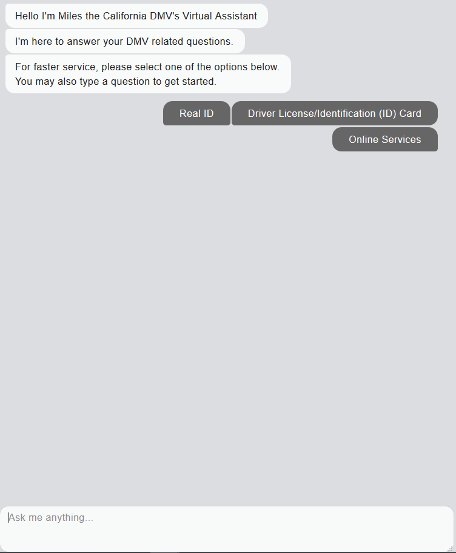

# New and Improved Miles Chatbot 

## Demo
[Public Link on AWS](http://chatbot-dev-dgorhe.s3-website-us-west-1.amazonaws.com/)

## To-do List
- ~~Complete flow.js with all questions from original Miles~~
- Add hyperlinks for appropriate buttons
- Add topics to nlp.js
    - Dynamically generate topics object
    - Manually create topics object
- ~~Connect nlp.js to index.html~~ 
- ~~add basic NLP~~
- Add survey functionality
    - ability to change survey frequency
    - Saving survey responses
    - Functions to check whether survey will provide insight (i.e. survey response filtering)
- Add "live chat" and "translate" buttons for UI
- Implement machine translation through SDLC
- Change color scheme to match original Miles
- Add gifs to README
- Implement webservice with SymSpellPy
- Migrate Miles to Amazon EC2 instance

## Libraries
- [SymSpellPy](https://github.com/mammothb/symspellpy)
- [Chat-bubbles](https://github.com/dmitrizzle/chat-bubble)

## Screenshots

